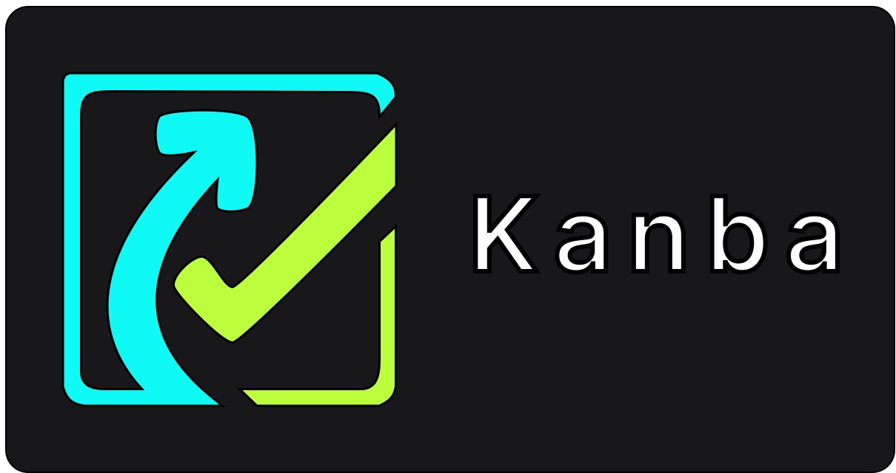
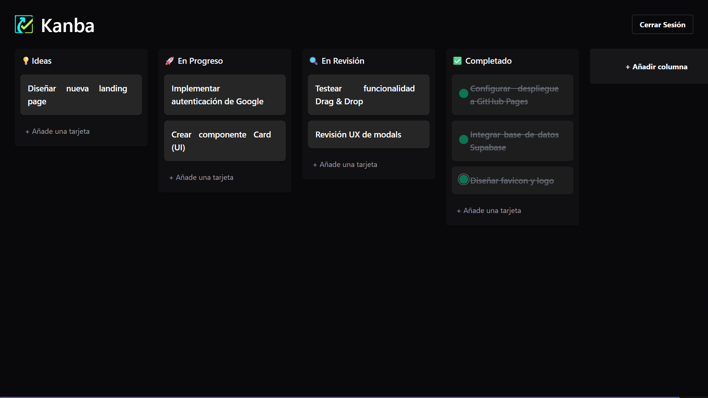

# 🚀 Kanba - Modern Fullstack Kanban Board

   
  
   
   
  
<em>¡No necesitas instalar nada! Haz clic en el botón de arriba para probar la aplicación.</em>

   
  
  ⚠️ **Nota para Usuarios Móviles:** Esta aplicación está diseñada para una experiencia óptima en escritorio. Se recomienda visualizarla en pantallas de al menos 1024px de ancho. Si accedes desde un dispositivo móvil, verás un mensaje de aviso.

  

---

## 📋 Descripción

**Kanba** es una aplicación de gestión de proyectos inspirada en Trello, diseñada para ser rápida, intuitiva y robusta. 

A diferencia de una simple "To-Do List", Kanba implementa un sistema complejo de **Drag and Drop**, sincronización de datos en **tiempo real** y autenticación segura. Está construida con las mejores prácticas de **React** y **TypeScript**, demostrando una arquitectura escalable y limpia.

## ✨ Características Destacadas

- **🔄 Sincronización Realtime (Supabase):** Si abres la app en dos pestañas (o dispositivos) diferentes, verás cómo las tarjetas se mueven solas al instante. Ideal para trabajo en equipo.
- **🤏 Drag & Drop Avanzado (@dnd-kit):**
  - Reordenamiento suave de tarjetas dentro de una columna.
  - Movimiento de tarjetas entre diferentes columnas.
  - Accesibilidad y animaciones fluidas.
- **🔐 Autenticación Completa:**
  - Login clásico (Email/Pass).
  - **OAuth** integrado con Google y GitHub.
- **🎨 UI/UX Pulida:**
  - Diseño *Desktop-first* (optimizado para grandes tableros).
  - Barras de desplazamiento personalizadas.
  - Feedback instantáneo con notificaciones (Toasts).

## 🛠️ Stack Tecnológico

| Área | Tecnologías |
|------|-------------|
| **Frontend** | React 18, TypeScript, Vite |
| **Estilos** | Tailwind CSS, CSS Modules (Custom Scrollbars) |
| **Estado Global** | Zustand (Gestión centralizada y limpia) |
| **Interacciones** | @dnd-kit (Core, Sortable, Utilities) |
| **Backend / DB** | Supabase (PostgreSQL, Auth, Realtime) |

---

 Desarrollado por <a href="https://www.linkedin.com/in/pabloalmellones" target="_blank">Pablo Almellones</a> 

